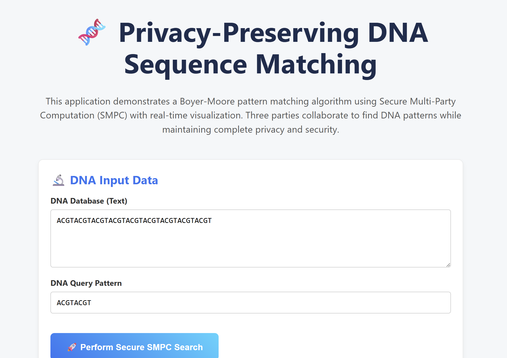
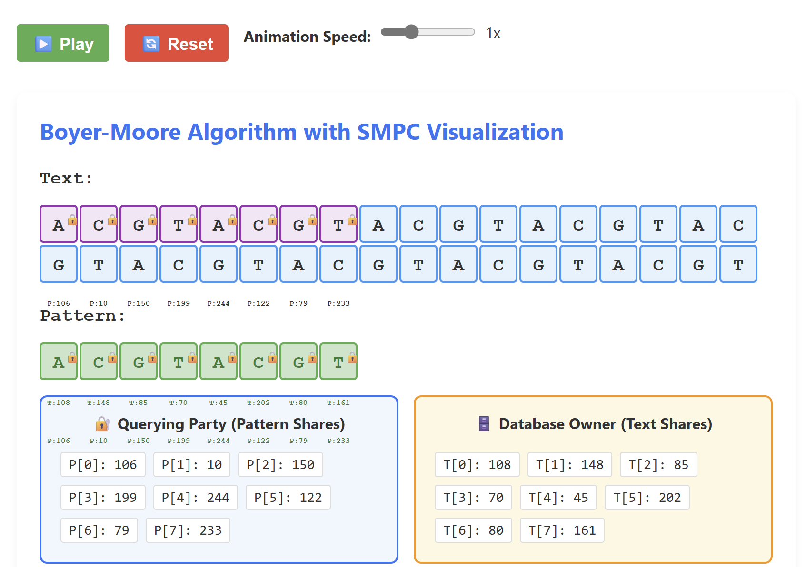
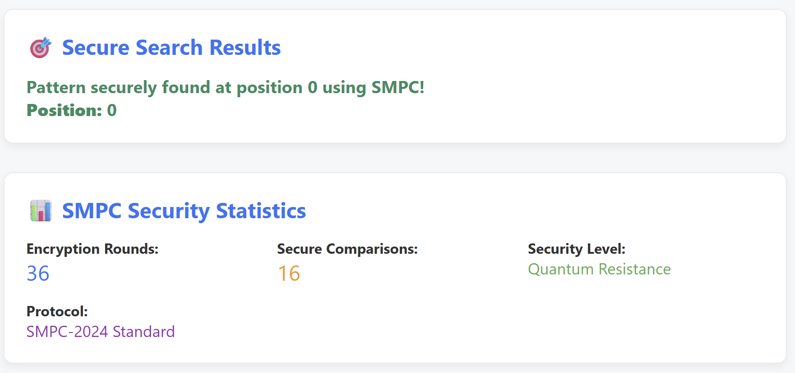

# 🧬 Privacy-Preserving Boyer-Moore Based Approach for DNA Sequence Matching in Forensic Databases

[](https://nextjs.org/)
[](https://www.typescriptlang.org/)
[](https://reactjs.org/)

## 🌟 Key Features

### 🔐 **Privacy Protection**
- **3-Party SMPC Protocol**: Querying Party, Database Owner, and Trusted Third Party
- **Zero-Knowledge Proofs**: No party can see the complete data of others
- **Secret Sharing**: Every character is split into cryptographic shares

### 🎬 **Interactive Real-Time Visualization**
- **Live Algorithm Animation**: Boyer-Moore algorithm execute step-by-step
- **Multi-Party Interaction**: Observe secure communication between parties

### 🧬 **DNA-Specific Implementation**
- **ACGT Validation**: Only accepts valid DNA nucleotide sequences
- **Pattern Matching**: Efficient searching in large DNA databases
- **Privacy-Preserving Queries**: Search without revealing sensitive genetic data

### 📊 **Comprehensive Analytics**
- **Security Metrics**: Track encryption rounds and secure comparisons
- **Protocol Compliance**: Real-time SMPC protocol verification

## 🚀 Quick Start

### Prerequisites
- Node.js 18+
- npm or yarn

### Installation

```bash
git clone https://github.com/graceevelyns/dna-search.git
cd dna-search

# install dependencies
npm install

# run development server
npm run dev

# open browser
open http://localhost:3000
```

## 🏗️ Architecture

```
┌─────────────────┐    ┌─────────────────┐    ┌─────────────────┐
│   Querying      │    │   Database      │    │   Trusted       │
│   Party         │    │   Owner         │    │   Third Party   │
│                 │    │                 │    │                 │
│ • Has Pattern   │    │ • Has Text      │    │ • Coordinates   │
│ • Creates       │◄──►│ • Creates       │◄──►│   Computation   │
│   Shares        │    │   Shares        │    │ • Secure        │
│ • Never sees    │    │ • Never sees    │    │   Comparison    │
│   full text     │    │   pattern       │    │ • Zero Knowledge│
└─────────────────┘    └─────────────────┘    └─────────────────┘
```

## 🎨 Screenshots

### Main Interface


### Live Visualization


### Security Analytics


## 🛠️ Technology Stack

- **Frontend**: Next.js 15.3.4, React 18, TypeScript
- **Styling**: CSS
- **API**: Next.js API Routes
- **Cryptography**: Custom SMPC implementation
- **Algorithms**: Boyer-Moore string matching
- **Visualization**: Custom React components

## 🙌🏻 Made by
Grace Evelyn Simon (13523087)